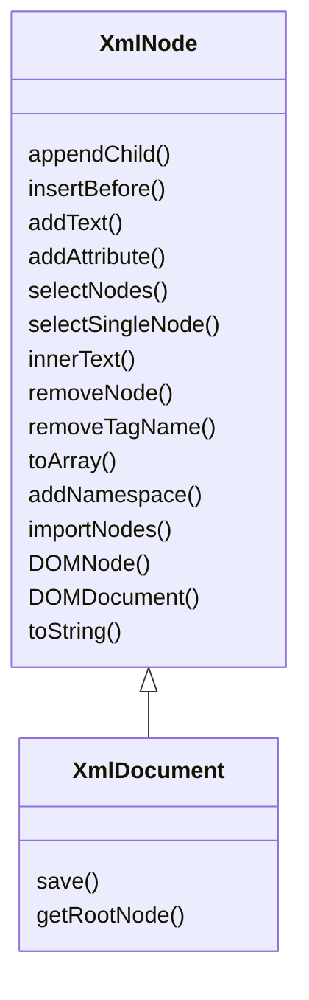
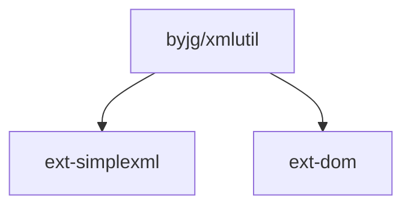

# XmlUtil

[](https://github.com/byjg/php-xmlutil/actions/workflows/phpunit.yml)
[](http://opensource.byjg.com)
[](https://github.com/byjg/php-xmlutil/)
[](https://opensource.byjg.com/opensource/licensing.html)
[](https://github.com/byjg/php-xmlutil/releases/)

A utility class to make it easy work with XML in PHP

## Examples

### Create a new XML Document and add nodes

```php
<?php
use ByJG\Util\XmlDocument;

$xml = new XmlDocument('<root />');

$myNode = $xml->appendChild('mynode');
$myNode->appendChild('subnode', 'text');
$myNode->appendChild('subnode', 'more text');
$otherNode = $myNode->appendChild('othersubnode', 'other text');
$otherNode->addAttribute('attr', 'value');

echo $xml->toString(format: true);
```

will produce the follow xml

```xml
<?xml version="1.0" encoding="utf-8"?>
<root>
  <mynode>
    <subnode>text</subnode>
    <subnode>more text</subnode>
    <othersubnode attr="value">other text</othersubnode>
  </mynode>
</root>
```

### Convert to array

```php
$array = $xml->toArray();
```

### Select a single node based on XPath

```php
$node = $xml->selectSingleNode('//subnode');
```

### Select all nodes based on XPath

```php
$nodeList = $xml->selectNodes($myNode, '//subnode');
```

### Working with xml namespaces

Add a namespace to the document

```php
$xml->addNamespace('my', 'http://www.example.com/mytest/');
```

will produce

```xml
<?xml version="1.0" encoding="utf-8"?>
<root xmlns:my="http://www.example.com/mytest/"> 
    ...
</root>
``````

Add a node with a namespace prefix

```php
$xml->appendChild('my:othernodens', 'teste');
```

Add a node with a namespace

```php
$xml->appendChild('nodens', 'teste', 'http://www.example.com/mytest/');
```

## Diagram



## Bonus - CleanDocument

XmlUtil have a class for selectively remove specific marks (tags)
from the document or remove all marks.

Example:

```php
<?php

$document = new \ByJG\Util\CleanDocument($documentXmlOrHtml);

$document
    ->removeContentByTag('a', 'name')
    ->removeContentByProperty('src')
    ->stripTagsExcept(['img'])
    ->get();

```

## Install

```bash
composer require "byjg/xmlutil"
```

## Running the Tests

```bash
vendor/bin/phpunit
```

## Dependencies




----
[Open source ByJG](http://opensource.byjg.com)