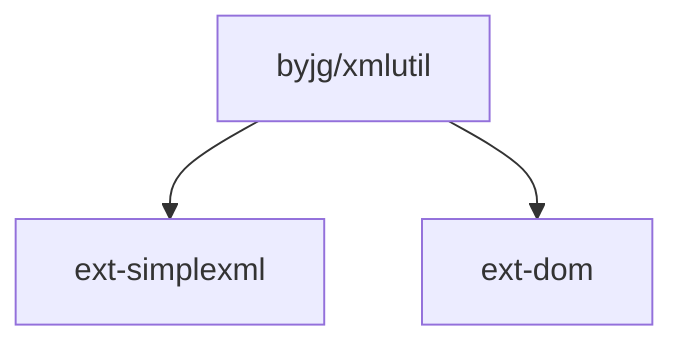

# XmlUtil

[](https://github.com/byjg/php-xmlutil/actions/workflows/phpunit.yml)
[](http://opensource.byjg.com)
[](https://github.com/byjg/php-xmlutil/)
[](https://opensource.byjg.com/opensource/licensing.html)
[](https://github.com/byjg/php-xmlutil/releases/)

A utility class to make it easy work with XML in PHP

## Examples

- [Create a new XML Document using the API](docs/using-api.md)
- [Working with namespaces](docs/namespaces.md)
- [Query a XMLDocument](docs/query-document.md)
- [Convert any model to XML](docs/convert-model-xml.md)
- [Use Attributes to help in the conversion](docs/convert-model-xml-withattributes.md)
- [Clean an XML document removing specific tags](docs/clean-document.md)

## Install

```bash
composer require "byjg/xmlutil"
```

## Running the Tests

```bash
vendor/bin/phpunit
```

## Dependencies




----
[Open source ByJG](http://opensource.byjg.com)