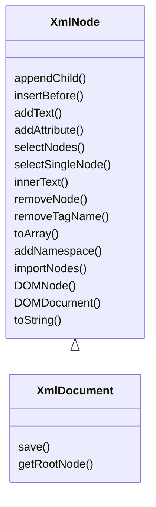

# Using the API

## Example

```php
<?php
use ByJG\XmlUtil\XmlDocument;

$xml = new XmlDocument('<root />');

$myNode = $xml->appendChild('mynode');
$myNode->appendChild('subnode', 'text');
$myNode->appendChild('subnode', 'more text');
$otherNode = $myNode->appendChild('othersubnode', 'other text');
$otherNode->addAttribute('attr', 'value');

echo $xml->toString(format: true);
```

will produce the follow xml

```xml
<?xml version="1.0" encoding="utf-8"?>
<root>
  <mynode>
    <subnode>text</subnode>
    <subnode>more text</subnode>
    <othersubnode attr="value">other text</othersubnode>
  </mynode>
</root>
```

## Convert to array

```php
$array = $xml->toArray();
```

## Convert to String

```php
$array = $xml->toString();
```


## Diagram


